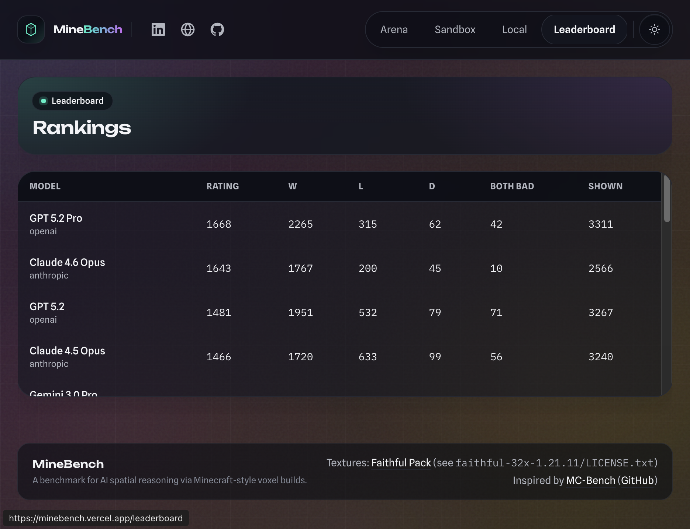

<p align="center">
  <a href="https://minebench.ai">
    
  </a>
</p>

<p align="center">
  <a href="docs/"><strong>[ Read the Docs ]</strong></a>
</p>

<p align="center">
  <a href="https://minebench.ai">
    
  </a>
  <a href="LICENSE">
    
  </a>
  <a href="https://buymeacoffee.com/ammaaralam">
    
  </a>
</p>

---

# MineBench

**A benchmark for evaluating AI spatial reasoning through Minecraft-style voxel construction.**

Models are given a natural-language prompt and must produce raw 3D coordinates as JSON. They are provided no images or 3D tools, only a custom voxelBuilder function which allows them to make a JSON past their token output limit and gives primitive tools such as lines, rectangles, and cubes. MineBench visualizes the output and ranks models via head-to-head ELO voting.

**[Try it live](https://minebench.ai)**


## Why MineBench?

Most LLM benchmarks test text and raw accuracy. MineBench instead tests whether a model reason about 3D space. Given a prompt like "a medieval castle with four towers", the model must mentally construct geometry, pick materials, and output thousands of precise block coordinates. No vision model or diffusion – just math and spatial logic.

As it turns out, this kind of spatial reasoning correlates strongly with a model's raw general intelligence; the MineBench leaderboard tracks, anecdotally, the same hierarchy that most people observe in real-world usage: the smartest reasoning models are clearly visible when asked to produce visual builds.

MineBench, unlike other benchmarks, gives an easy way to visually determine (at least one aspect of) a model's raw intelligence. The ELO system also ends up highlighting which models are clearly 'bench-maxed' (i.e. when a model has amazing benchmarks on paper, but clearly lacks in real world usage).


## Features

- **Arena** — blind head-to-head comparisons of pre-generated builds with ELO-rated voting
- **Sandbox** — compare existing builds or generate new ones live with your own API keys
- **Local Lab** — copy the benchmark prompt, run it in any model, paste the JSON back to render
- **Leaderboard** — live rankings with win/loss/draw stats across all models



## Supported Models

MineBench currently benchmarks models from OpenAI, Anthropic, Google, Moonshot, DeepSeek, xAI, Z.AI, Qwen, Meta, and any model available through OpenRouter.

## Contributing

Contributions are welcome! See [CONTRIBUTING.md](CONTRIBUTING.md) for how to add new models, submit benchmark prompts, improve the UI, or fix bugs.

## Support MineBench

Running MineBench is expensive: model inference, storage, and hosting costs add up quickly as the benchmark grows.  
If MineBench is useful to you and you want to help keep updates and new model runs coming, you can support it here:

**[Buy Me a Coffee](https://buymeacoffee.com/ammaaralam)**

## License

[MIT](LICENSE)

Texture pack: [Faithful](https://faithfulpack.net/) (see `faithful-32x-1.21.11/LICENSE.txt`)

Inspired by [MC-Bench](https://mcbench.ai/) ([GitHub](https://github.com/mc-bench))

---

## Quick Start (Local)

This path lets you run the full app and compare existing builds from `uploads/` without generating new ones.

### 1) Prerequisites

- Node.js `18+`
- `pnpm`
- Docker (for local Postgres)

### 2) Install dependencies

```bash
pnpm install
```

### 3) Create env file

```bash
cp .env.example .env
```

### 4) Start app + database

```bash
pnpm dev:setup
```

`pnpm dev:setup` will:
- ensure `.env` exists
- build the texture atlas
- reset local Docker Postgres volume
- run Prisma migrations
- start Next.js dev server on `http://localhost:3000`

### 5) Seed local DB from checked-in `uploads/`

In a second terminal:

```bash
pnpm prompt --import
```

Then open:
- `http://localhost:3000/` (Arena)
- `http://localhost:3000/sandbox` (Benchmark Compare works immediately)
- `http://localhost:3000/leaderboard`

### Alternative startup (keep DB state)

If you do not want to reset the DB volume each time:

```bash
pnpm db:up
pnpm prisma:migrate
pnpm dev
```

## Live Generation (Bring Your Own Keys)

To generate fresh builds in `/sandbox` -> `Live Generate`:

1. Open `http://localhost:3000/sandbox`
2. Switch to `Live Generate`
3. Enter either:
   - an `OpenRouter` key (recommended), or
   - provider-specific keys (OpenAI/Anthropic/Gemini/Moonshot/DeepSeek)
4. Pick 2 models and click `Generate`

Notes:
- Keys entered in Sandbox are stored in browser `localStorage` and sent only with that request.
- In production, `/api/generate` requires request keys unless `MINEBENCH_ALLOW_SERVER_KEYS=1`.

## Environment Variables

Copy `.env.example` to `.env` and set what you need:

### Core

- `DATABASE_URL` (required): pooled/runtime Postgres URL
- `DIRECT_URL` (required): direct Postgres URL for Prisma migrations
- `ADMIN_TOKEN` (required for `/api/admin/*`)

### Provider keys (any subset)

- `OPENAI_API_KEY`
- `ANTHROPIC_API_KEY`
- `GOOGLE_AI_API_KEY`
- `MOONSHOT_API_KEY`
- `DEEPSEEK_API_KEY`
- `OPENROUTER_API_KEY`

### Optional provider/runtime tuning

- `MINEBENCH_ALLOW_SERVER_KEYS=1` (production opt-in for server env keys in `/api/generate`)
- `ANTHROPIC_OPUS_4_6_EFFORT=low|medium|high|max`
- `ANTHROPIC_SONNET_4_6_EFFORT=low|medium|high`
- `ANTHROPIC_STREAM_RESPONSES=1`
- `OPENAI_STREAM_RESPONSES=1`
- `OPENAI_USE_BACKGROUND_MODE=1` (recommended for long-running Responses jobs, especially GPT-5.2 Pro)
- `OPENAI_BACKGROUND_POLL_MS=2000` (poll interval for background mode)
- `OPENAI_GPT5_PRO_TIMEOUT_MS=7200000` and `OPENAI_REQUEST_TIMEOUT_MS` (optional timeout overrides)
- `ANTHROPIC_ENABLE_1M_CONTEXT_BETA=1`
- `ANTHROPIC_THINKING_BUDGET` (legacy/manual thinking models)
- `OPENROUTER_BASE_URL`, `MOONSHOT_BASE_URL`, `DEEPSEEK_BASE_URL`
- `AI_DEBUG=1` (logs raw model output on failures)
- `MINEBENCH_TOOL_OUTPUT_DIR`, `MINEBENCH_TOOL_TIMEOUT_MS`, `MINEBENCH_TOOL_MAX_*` (advanced `voxel.exec` controls)

## Benchmark Behavior

### Arena settings (fixed)

- Grid size: `256`
- Palette: `simple`
- Mode: `precise`

### Matchup sampling and voting

- Arena matchups are sampled from pre-seeded builds only.
- Models are sampled with inverse weighting of `shownCount` to balance exposure.
- A session cookie (`mb_session`) is used so each session can vote once per matchup.
- Vote options: `A`, `B`, `TIE`, `BOTH_BAD`.
- ELO updates:
  - `A/B/TIE`: standard pairwise update (`K=16`)
  - `BOTH_BAD`: both models are penalized vs baseline

### Rate limiting

Middleware rate limits non-admin API routes to `18 requests / 10 seconds` per `IP + path`.

## Voxel Task Format

Models produce JSON in this schema:

```json
{
  "version": "1.0",
  "boxes": [
    { "x1": 10, "y1": 0, "z1": 10, "x2": 20, "y2": 6, "z2": 20, "type": "stone" }
  ],
  "lines": [
    { "from": { "x": 15, "y": 7, "z": 15 }, "to": { "x": 15, "y": 18, "z": 15 }, "type": "oak_log" }
  ],
  "blocks": [
    { "x": 15, "y": 19, "z": 15, "type": "glowstone" }
  ]
}
```

Validation pipeline:
- expands `boxes` and `lines`
- normalizes/drops invalid block types
- drops out-of-bounds coordinates
- deduplicates final blocks
- enforces max block limits

Current generation constraints:
- grid sizes: `64`, `256`, `512`
- minimum blocks: `200` / `500` / `800`
- max blocks: `196,608` / `2,000,000` / `4,000,000`
- minimum structural span checks for width/depth and height (to reject tiny builds)

Block palettes:
- `simple` and `advanced` are defined in `lib/blocks/palettes.json`

## Seeding and Import Workflows

### Option A: import local JSONs from `uploads/` (no provider calls)

```bash
pnpm prompt                  # inspect detected prompt folders/builds
pnpm prompt --import         # import into local DB
pnpm prompt --import --overwrite
```

Create a new prompt folder scaffold:

```bash
pnpm prompt --init --prompt arcade --text "A classic arcade cabinet with ..."
```

### Option B: seed curated prompts + generate missing builds via API

Set `ADMIN_TOKEN` in `.env`, restart dev server, then:

```bash
# status
curl -sS "http://localhost:3000/api/admin/status" \
  -H "Authorization: Bearer $ADMIN_TOKEN"

# prompts + model catalog only (no generation)
curl -sS -X POST "http://localhost:3000/api/admin/seed?generateBuilds=0" \
  -H "Authorization: Bearer $ADMIN_TOKEN"

# dry run
curl -sS -X POST "http://localhost:3000/api/admin/seed?dryRun=1" \
  -H "Authorization: Bearer $ADMIN_TOKEN"

# generate missing builds in batches (repeat until done=true)
curl -sS -X POST "http://localhost:3000/api/admin/seed?batchSize=2" \
  -H "Authorization: Bearer $ADMIN_TOKEN"
```

At least one provider key must be configured (`OPENROUTER_API_KEY` or a direct provider key) for generation to run.

### Option C: import external model output directly

Use this to import JSON from ChatGPT web or other tools:

```bash
curl -sS -X POST "http://localhost:3000/api/admin/import-build?modelKey=openai_gpt_5_2_pro&promptText=$(node -p 'encodeURIComponent(process.argv[1])' 'A medieval stone castle')&overwrite=1" \
  -H "Authorization: Bearer $ADMIN_TOKEN" \
  --data-binary "@uploads/castle/castle-gpt-5-2-pro.json"
```

Reference prompt template: `docs/chatgpt-web-voxel-prompt.md`

## API Reference

### Public routes

- `POST /api/generate`
  - body: `{ prompt, gridSize, palette, modelKeys, providerKeys? }`
  - response: `application/x-ndjson` stream (`hello`, `start`, `retry`, `delta`, `result`, `error`, `ping`)
- `GET /api/arena/matchup?promptId=<optional>`
- `POST /api/arena/vote`
  - body: `{ matchupId, choice }`
  - `choice`: `A | B | TIE | BOTH_BAD`
- `GET /api/arena/prompts`
- `GET /api/sandbox/benchmark?promptId=&modelA=&modelB=`
- `GET /api/leaderboard`

### Admin routes (Bearer `ADMIN_TOKEN` required)

- `GET /api/admin/status`
- `POST /api/admin/seed?dryRun=1&generateBuilds=0&batchSize=2`
- `POST /api/admin/import-build?modelKey=...&promptId=...|promptText=...&gridSize=256&palette=simple&mode=precise&overwrite=1`

## Useful Scripts

- `pnpm dev:setup`: full local bootstrap (resets DB, migrates, runs dev server)
- `pnpm dev`: start Next.js dev server
- `pnpm build` / `pnpm start`: production build and serve
- `pnpm lint`: ESLint
- `pnpm db:up` / `pnpm db:down` / `pnpm db:reset`
- `pnpm prisma:migrate` / `pnpm prisma:dev` / `pnpm prisma:generate`
- `pnpm atlas`: rebuild texture atlas
- `pnpm prompt`: inspect/import prompt build files from `uploads/`
- `pnpm batch:generate`: batch-generate and/or upload build files
- `pnpm elo:reset --yes [--keep-history]`: reset leaderboard stats

## Batch Generation Examples

```bash
# status only
pnpm batch:generate

# generate missing files
pnpm batch:generate --generate

# generate without voxel.exec tool mode
pnpm batch:generate --generate --notools

# upload existing files to production
pnpm batch:generate --upload

# generate + upload with prompt/model filters
pnpm batch:generate --generate --upload --prompt castle --model sonnet

# all options
pnpm batch:generate --help
```

Build files are written under `uploads/<prompt-slug>/`.

## Quality Checks

- `pnpm lint` for static checks
- no automated test suite is configured yet

## Database Notes

Prisma models:
- `Model`
- `Prompt`
- `Build`
- `Matchup`
- `Vote`

Prisma creates quoted PascalCase table names in Postgres.
When querying manually, use quoted identifiers, for example:

```sql
select count(*) from public."Prompt";
```

## Project Structure

```text
app/                Next.js App Router pages and API routes
components/         UI and voxel viewer components
lib/ai/             generation pipeline and provider adapters
lib/arena/          matchup sampling and ELO logic
lib/blocks/         palette and texture atlas mapping
lib/voxel/          voxel types, validation, mesh helpers
prisma/             schema and migrations
scripts/            setup, import, generation, maintenance utilities
uploads/            local build JSON files and prompt folders
```

## Troubleshooting

- `No seeded prompts found` on Arena:
  - Run `pnpm prompt --import` or use `/api/admin/seed`.
- `Missing ADMIN_TOKEN` / `Invalid token` on admin endpoints:
  - Set `ADMIN_TOKEN` in `.env` and send `Authorization: Bearer $ADMIN_TOKEN`.
- `/api/generate` returns no-key error in production:
  - send `providerKeys` from client or set `MINEBENCH_ALLOW_SERVER_KEYS=1`.
- DB connection errors:
  - ensure Docker is running, `DATABASE_URL`/`DIRECT_URL` are valid, then run `pnpm db:up`.
- Missing/broken block textures:
  - run `pnpm atlas` to rebuild `public/textures/atlas.png`.

## Deployment Notes

- Works well with Vercel + Supabase Postgres.
- Recommended:
  - `DATABASE_URL`: Supabase pooler URL (`pgbouncer=true`)
  - `DIRECT_URL`: Supabase direct URL (for Prisma migrations)

## Attribution

- Textures: Faithful pack (`faithful-32x-1.21.11/`)
- License: see `faithful-32x-1.21.11/LICENSE.txt`

_[Disclaimer: all documentation (including README) and frontend is almost entirely AI-created]_
