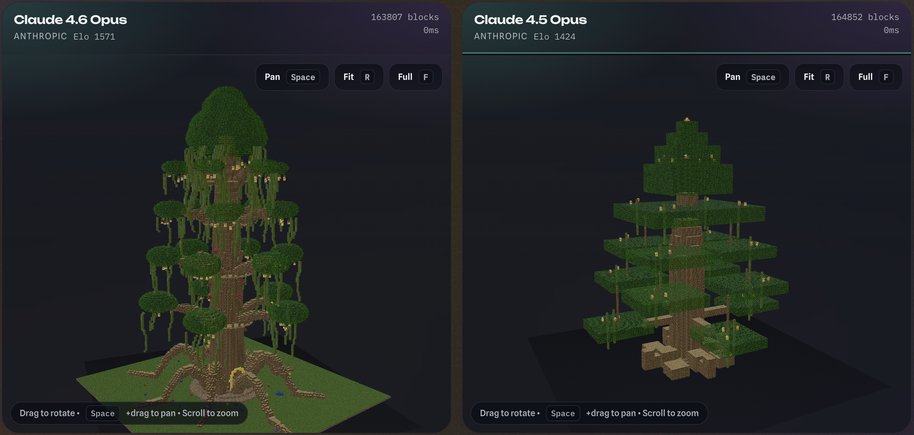

# MineBench

MineBench is a benchmark for comparing AI models on Minecraft-style voxel builds. It focuses on spatial reasoning, prompt fidelity, and 3D structure rather than image similarity or text-only reasoning.



## Benchmark goals (what makes this "real")
- Fixed task format: every model must output the same voxel JSON schema.
- Fixed constraints: grid size, palette, min/max blocks, and structural checks.
- Curated prompt set: Arena uses a fixed list, not user prompts.
- Pre-seeded builds: Arena uses stored builds so every matchup is generated under identical settings.
- Pairwise evaluation: head-to-head voting feeds a single Elo ladder.
- Auditability: block counts, generation time, and validation warnings are stored and shown.

## Arena mode (the benchmark)
- Route: `/`
- Settings: grid 256, simple palette, mode "precise"
- Prompts: `lib/arena/curatedPrompts.ts`
- Matchups: models are sampled with inverse weight of `shownCount` to balance exposure
- Voting: A, B, Tie, Both bad (one vote per matchup per session cookie)
- Ranking: Elo K=16; "both bad" penalizes both models vs a baseline rating

## Sandbox mode (exploration)
- Route: `/sandbox`
- Choose prompt, grid (64/256/512), palette (simple/advanced), and two models
- Streams NDJSON events as each model finishes
- Useful for quick comparisons but does not affect the leaderboard

## Local Lab (bring-your-own JSON)
- Route: `/local`
- Shows the exact MineBench system prompt (editable + copyable) so you can run the task in any model (including local LLMs)
- Paste the resulting JSON to preview the voxel build client-side (nothing is uploaded or saved)

## Task format (voxel JSON)
Models must return JSON with primitives (boxes/lines) plus explicit blocks:

```json
{
  "version": "1.0",
  "boxes": [
    { "x1": 10, "y1": 0, "z1": 10, "x2": 20, "y2": 6, "z2": 20, "type": "stone" }
  ],
  "lines": [
    { "from": { "x": 15, "y": 7, "z": 15 }, "to": { "x": 15, "y": 18, "z": 15 }, "type": "oak_log" }
  ],
  "blocks": [
    { "x": 15, "y": 19, "z": 15, "type": "glowstone" }
  ]
}
```

Primitives are expanded server-side, then validated, deduplicated, and clamped to the grid.

### Block palettes
- Simple palette: 22 blocks
- Advanced palette: 77 total blocks (simple + 55 additional)
- See `lib/blocks/palettes.json`

## Validation and constraints (enforced)
- Grid coordinates must be in `[0, gridSize - 1]`
- Max blocks = 75% of grid volume (64: 196,608; 256: 2,000,000 cap; 512: 4,000,000 cap)
- Min blocks = 200 / 500 / 800 for 64 / 256 / 512
- Minimum footprint ~55% of grid width and minimum height ~14% of grid height
- Unknown block types are normalized when possible or dropped with warnings
- Out-of-bounds blocks are dropped; duplicates are deduped
- Metrics recorded: block count, generation time, warnings

## Leaderboard
- Route: `/leaderboard`
- Elo updates from Arena votes only
- "Both bad" applies a baseline penalty to both models

## Data model (Postgres)
- Prisma creates quoted PascalCase tables (e.g. `"Prompt"`, `"Build"`). In SQL, use quotes or schema-qualify like `select count(*) from public."Prompt";`.
- `Model`: provider, displayName, Elo, counts
- `Prompt`: curated prompt text
- `Build`: prompt + model + grid + palette + mode with voxel JSON and metrics
- `Matchup`: two models, two builds, one prompt
- `Vote`: one vote per matchup per session

## Local dev

```bash
pnpm install
pnpm dev:setup
```

`pnpm dev:setup` builds the texture atlas, resets the local Docker Postgres volume, runs migrations, and starts Next.js.

If you want to keep your DB state, use:

```bash
pnpm db:up
pnpm prisma:migrate
pnpm dev
```

### Environment variables
Copy `.env.example` to `.env` and set:

- `DATABASE_URL` (Postgres connection string)
- `DIRECT_URL` (direct Postgres connection string for Prisma migrations)
- `ADMIN_TOKEN` (protects `/api/admin/*`)
- `OPENAI_API_KEY`
- `ANTHROPIC_API_KEY`
- `GOOGLE_AI_API_KEY`
- `AI_DEBUG=1` (optional; logs raw model output on errors)

Prisma uses `.env` for CLI operations. If you set `DATABASE_URL` in `.env.local`, the helper script will sync it to `.env`.

### Seeding the Arena (curated prompts + builds)

Make sure your shell has `ADMIN_TOKEN` set (or add it to `.env` and restart `pnpm dev`):

```bash
export ADMIN_TOKEN="..."
```

```bash
# Prompts + model catalog only (no AI calls)
curl -X POST "http://localhost:3000/api/admin/seed?generateBuilds=0" \
  -H "Authorization: Bearer $ADMIN_TOKEN"

# Dry run (see how many builds remain)
curl -X POST "http://localhost:3000/api/admin/seed?dryRun=1" \
  -H "Authorization: Bearer $ADMIN_TOKEN"

# Full seed (generates missing builds; repeat until done)
curl -X POST "http://localhost:3000/api/admin/seed" \
  -H "Authorization: Bearer $ADMIN_TOKEN"

# Smaller batches (1-3) to avoid timeouts
curl -X POST "http://localhost:3000/api/admin/seed?batchSize=2" \
  -H "Authorization: Bearer $ADMIN_TOKEN"
```

Repeat until it reports `done: true`. Arena requires seeded builds.

### Import builds from ChatGPT web (no API calls)

If you want to avoid API usage, you can generate a voxel build JSON using **chatgpt.com** and import it directly.

- Copy/paste prompt template: `docs/chatgpt-web-voxel-prompt.md`
- Import endpoint: `POST /api/admin/import-build`

```bash
# 1) Get prompt IDs (optional — you can also import by promptText)
curl -sS "http://localhost:3000/api/arena/prompts"

# 2) Save the ChatGPT response JSON into a local file (gitignored)
mkdir -p uploads
# (save as uploads/build.json)

# 3) Import the build by promptId (defaults: 256³, simple palette, mode=precise)
curl -sS -X POST "http://localhost:3000/api/admin/import-build?modelKey=openai_gpt_5_2_pro&promptId=YOUR_PROMPT_ID&overwrite=1" \
  -H "Authorization: Bearer $ADMIN_TOKEN" \
  --data-binary "@uploads/build.json"

# Or import by promptText (URL-encoded)
ENC_PROMPT="$(node -p 'encodeURIComponent(process.argv[1])' 'YOUR PROMPT TEXT HERE')"
curl -sS -X POST "http://localhost:3000/api/admin/import-build?modelKey=openai_gpt_5_2_pro&promptText=$ENC_PROMPT&overwrite=1" \
  -H "Authorization: Bearer $ADMIN_TOKEN" \
  --data-binary "@uploads/build.json"
```

The import route validates the JSON (including expanding `boxes`/`lines`) and stores it as a `Build` in Postgres.

### Batch generation (automated workflow)

For generating builds at scale, use the batch generation script:

```bash
# check current status (shows missing builds per prompt)
pnpm batch:status

# generate all missing builds
pnpm batch:generate

# generate for a specific prompt only
pnpm batch:generate --prompt steampunk

# generate for specific models only
pnpm batch:generate --model gemini

# generate and upload to production in one step
pnpm batch:generate --upload

# show help
pnpm batch:generate --help
```

#### Folder structure

Generated builds are saved to `uploads/{prompt-slug}/`:

```
uploads/
├── castle/
│   ├── castle-gpt-5-2.json
│   ├── castle-sonnet.json
│   └── ...
├── steampunk/
│   ├── steampunk-gpt-5-2.json
│   └── ...
└── ...
```

#### Model slugs

| Model Key | File Slug |
|-----------|-----------|
| `openai_gpt_5_2` | `gpt-5-2` |
| `openai_gpt_5_2_pro` | `gpt-5-2-pro` |
| `openai_gpt_5_1_codex_max` | `gpt-5-1-codex` |
| `openai_gpt_5_mini` | `gpt-5-mini` |
| `openai_gpt_4_1` | `gpt-4-1` |
| `anthropic_claude_4_5_sonnet` | `sonnet` |
| `anthropic_claude_4_5_opus` | `opus` |
| `gemini_3_0_pro` | `gemini-pro` |
| `gemini_3_0_flash` | `gemini-flash` |

#### Prompt slugs

| Slug | Prompt |
|------|--------|
| `steampunk` | A steampunk airship... |
| `carrier` | A flying aircraft carrier... |
| `locomotive` | A steam locomotive |
| `skyscraper` | A skyscraper |
| `treehouse` | A treehouse village... |
| `cottage` | A cozy cottage |
| `worldtree` | A massive world tree... |
| `floating` | A floating island ecosystem... |
| `shipwreck` | An underwater shipwreck... |
| `phoenix` | A phoenix rising from flames... |
| `knight` | A knight in armor |
| `castle` | A medieval stone castle... |

#### Recommended workflow

1. **Generate one prompt at a time** (to manage costs):
   ```bash
   pnpm batch:generate --prompt steampunk
   ```

2. **Or generate one model at a time**:
   ```bash
   pnpm batch:generate --model sonnet
   ```

3. **Upload after generating**:
   ```bash
   pnpm batch:generate --upload
   ```

The script prints individual curl commands for manual upload if you prefer more control.

## Texture attribution
This repo includes the Faithful texture pack at `faithful-32x-1.21.11`.
See `faithful-32x-1.21.11/LICENSE.txt` for license details.
