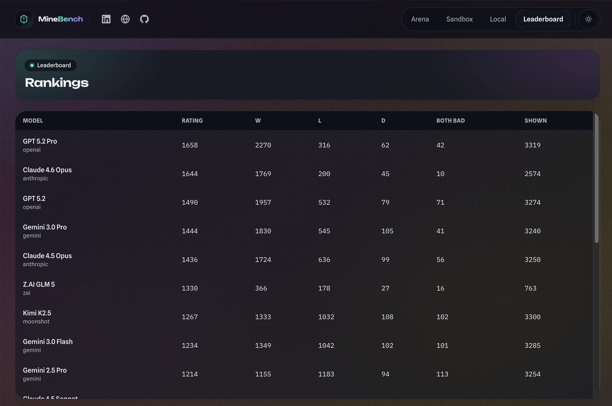

<p align="center">
  <a href="https://minebench.ai">
    
  </a>
</p>

<p align="center">
  <a href="docs/README.md"><strong>[ Read the Docs ]</strong></a>
</p>

<p align="center">
  <a href="https://minebench.ai">
    
  </a>
  <a href="https://github.com/Ammaar-Alam/minebench/releases/latest">
    
  </a>
  <a href="LICENSE">
    
  </a>
  <a href="https://buymeacoffee.com/ammaaralam">
    
  </a>
</p>

---

# MineBench

**A benchmark for evaluating AI spatial reasoning through Minecraft-style voxel construction.**

Models are given a natural-language prompt and must produce raw 3D coordinates as JSON. In tool mode, models call `voxel.exec` (minimal primitives: `block`, `box`, `line`) to generate large builds beyond token-only JSON limits. MineBench visualizes the output and ranks models via head-to-head voting with a confidence-aware Glicko-style system (public ordering by conservative score).

**[Try it live](https://minebench.ai)**


## Why MineBench?

Most LLM benchmarks test text and raw accuracy. MineBench instead tests whether a model reason about 3D space. Given a prompt like "a medieval castle with four towers", the model must mentally construct geometry, pick materials, and output thousands of precise block coordinates. No vision model or diffusion – just math and spatial logic.

As it turns out, this kind of spatial reasoning correlates strongly with a model's raw general intelligence; the MineBench leaderboard tracks, anecdotally, the same hierarchy that most people observe in real-world usage: the smartest reasoning models are clearly visible when asked to produce visual builds.

MineBench, unlike other benchmarks, gives an easy way to visually determine (at least one aspect of) a model's raw intelligence. The ranking system also highlights which models are clearly 'bench-maxed' (i.e. when a model has amazing benchmarks on paper, but clearly lacks in real world usage).


## Features

- **Arena** — blind head-to-head comparisons of pre-generated builds with confidence-aware ranking
- **Sandbox** — compare existing builds or generate new ones live with your own API keys
- **Local Lab** — copy the benchmark prompt, run it in any model, paste the JSON back to render
- **Leaderboard** — live rankings with win/loss/draw stats across all models

## Documentation

- Full docs index: [`docs/README.md`](docs/README.md)
- Local development: [`docs/local-development.md`](docs/local-development.md)
- Operations and API reference: [`docs/operations.md`](docs/operations.md)
- Deployment: [`docs/deployment.md`](docs/deployment.md)
- Ranking math and matchmaking walkthrough: [`docs/arena-ranking-system.md`](docs/arena-ranking-system.md)
- Ranking policy: [`docs/arena-ranking-validity-policy-v2.md`](docs/arena-ranking-validity-policy-v2.md)
- Voxel tool runtime, conversion, and import workflows: [`docs/voxel-exec-raw-output.md`](docs/voxel-exec-raw-output.md)



## Supported Models

MineBench currently benchmarks models from OpenAI, Anthropic, Google, Moonshot, DeepSeek, MiniMax, xAI, Z.AI, Qwen, Meta, and any model available through OpenRouter.

## Quick Start (Local)

This path lets you run the full app and compare existing builds from `uploads/` without generating new ones.

Prereqs: Node.js `18+`, `pnpm`, Docker.

```bash
pnpm install
cp .env.example .env
pnpm dev:setup
```

In a second terminal:

```bash
pnpm prompt --import
```

Then open:
- `http://localhost:3000/` (Arena)
- `http://localhost:3000/sandbox`
- `http://localhost:3000/leaderboard`

For environment variables, live generation, seeding/import workflows, batch generation, API routes, troubleshooting, and deployment, see the docs:

- [`docs/local-development.md`](docs/local-development.md)
- [`docs/operations.md`](docs/operations.md)
- [`docs/deployment.md`](docs/deployment.md)

## Contributing

Contributions are welcome! See [CONTRIBUTING.md](.github/CONTRIBUTING.md) for how to add new models, submit benchmark prompts, improve the UI, or fix bugs.

## Support MineBench

Running MineBench is expensive: model inference, storage, and hosting costs add up quickly as the benchmark grows.

Support directly via **[Buy Me a Coffee](https://buymeacoffee.com/ammaaralam)**.

MineBench is also sponsored by [3D-Agent](https://3d-agent.com), an AI assistant for Blender and 3D workflows. Use code `MINEBENCH10` for 10% off a subscription.

_Disclosure: MineBench earns a recurring affiliate commission when this code is used._

## License

[MIT](LICENSE)

Texture pack: [Faithful](https://faithfulpack.net/) (see `assets/texture-pack/LICENSE.txt`)

Inspired by [MC-Bench](https://github.com/mc-bench) and [VoxelBench](https://voxelbench.ai/)

_[Disclaimer: all documentation (including README) and frontend is almost entirely AI-created]_
