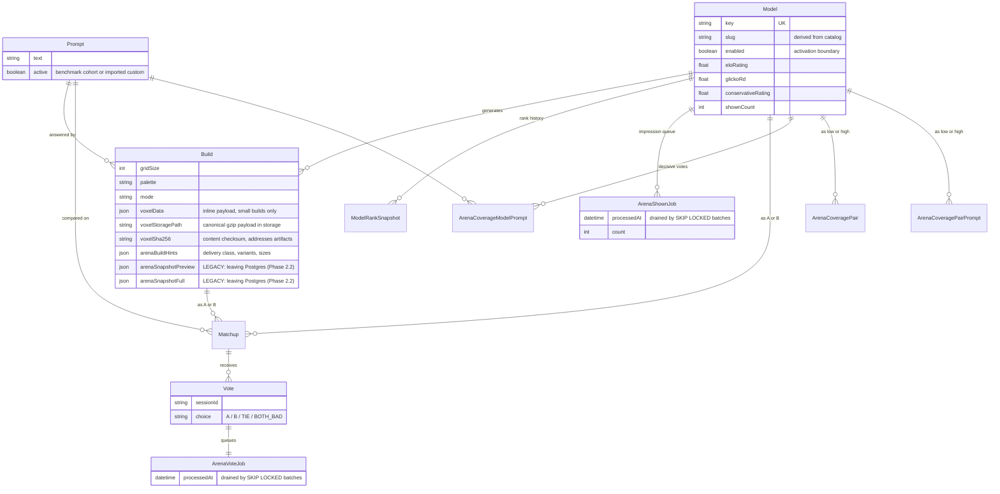
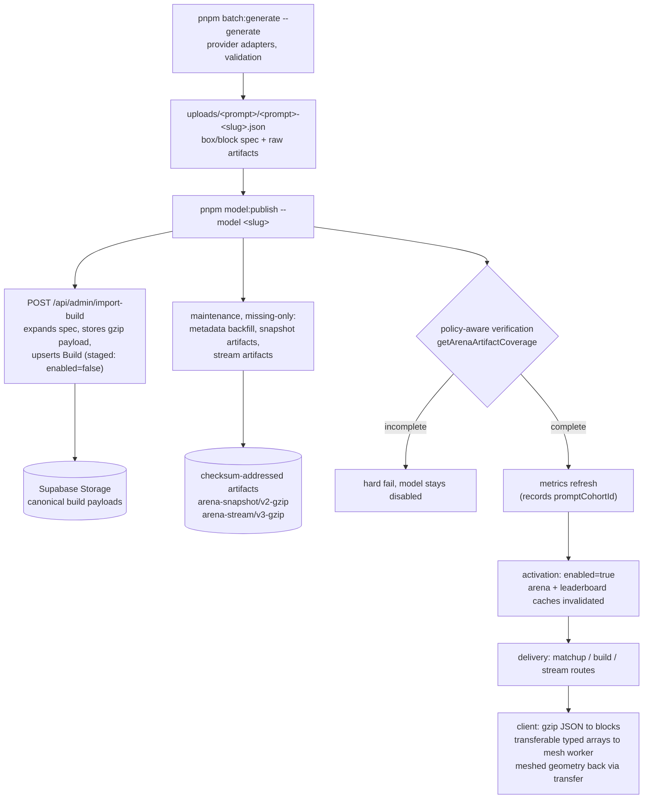
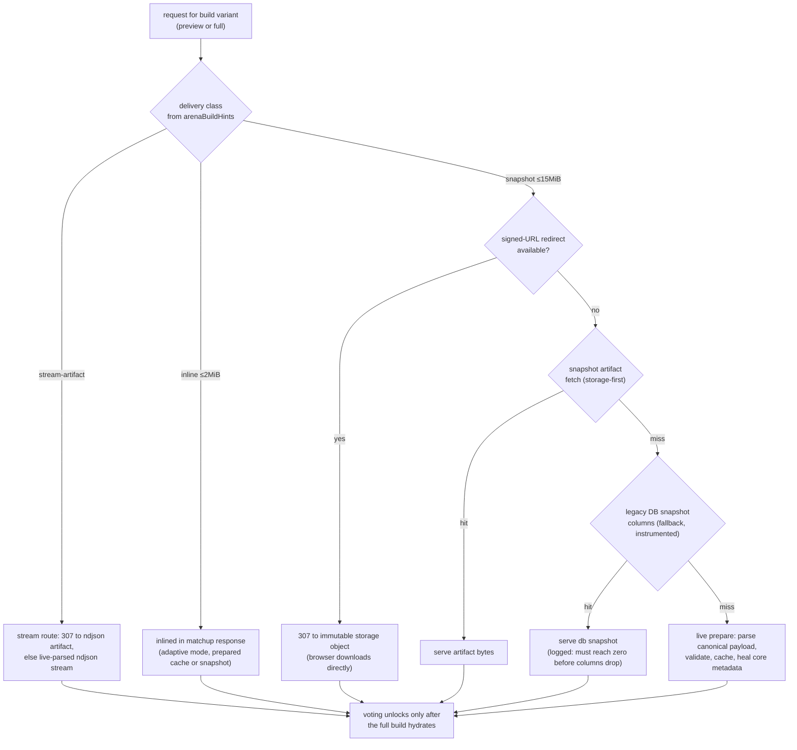

# Architecture: Data Model and Build Delivery

Three views of how MineBench stores and serves arena builds: the database
entities, the lifecycle of a build from generation to a rendered mesh, and the
decision flow that picks a delivery route per request.

## Database entities

Rating state lives on `Model` and is updated only by the vote-job drain (one
advisory-locked writer). Coverage tables hold decisive-vote tallies for
matchup sampling. Both job tables are append-then-drain queues; processed rows
older than 30 days are pruned by `pnpm arena:jobs:prune`.

## Build lifecycle

A model can never reach public surfaces with a partial cohort: imports stage it
disabled and only publish verification activates it. `arena:artifacts:audit
--deep` re-validates everything end to end (fetch, decompress, parse, checksum,
signed-URL delivery).

## Delivery decision flow

Artifacts are immutable and checksum-addressed, so every cache layer (CDN,
signed-URL cache, in-process body caches, client IndexedDB mesh cache) can
treat a hit as final. The DB snapshot columns are a compatibility fallback
scheduled for removal once production logs show zero fallback hits
(`arena snapshot db fallback` lines) through a full soak window.
