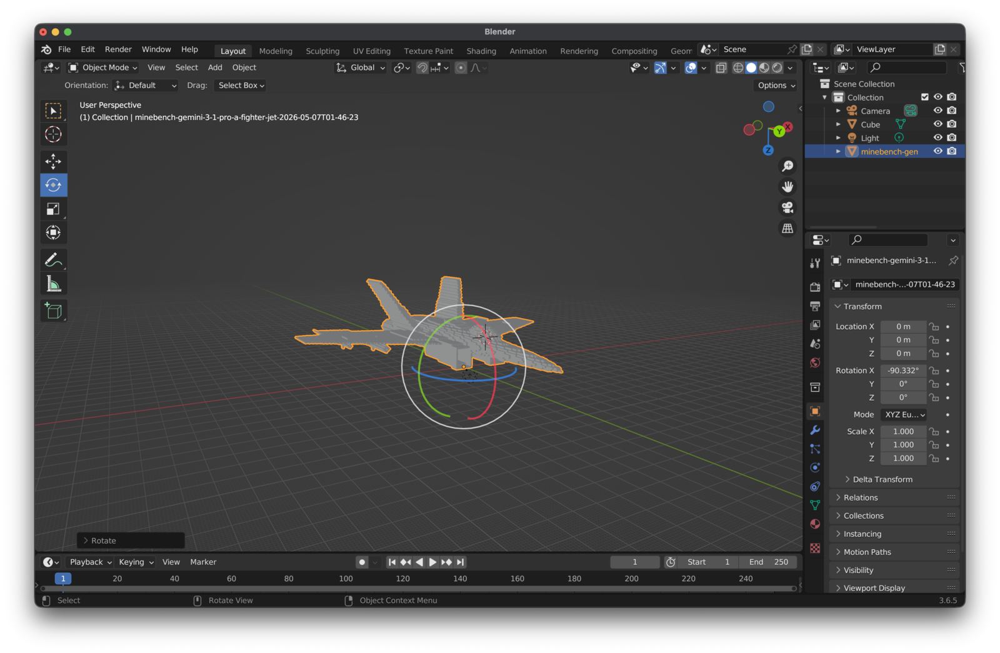
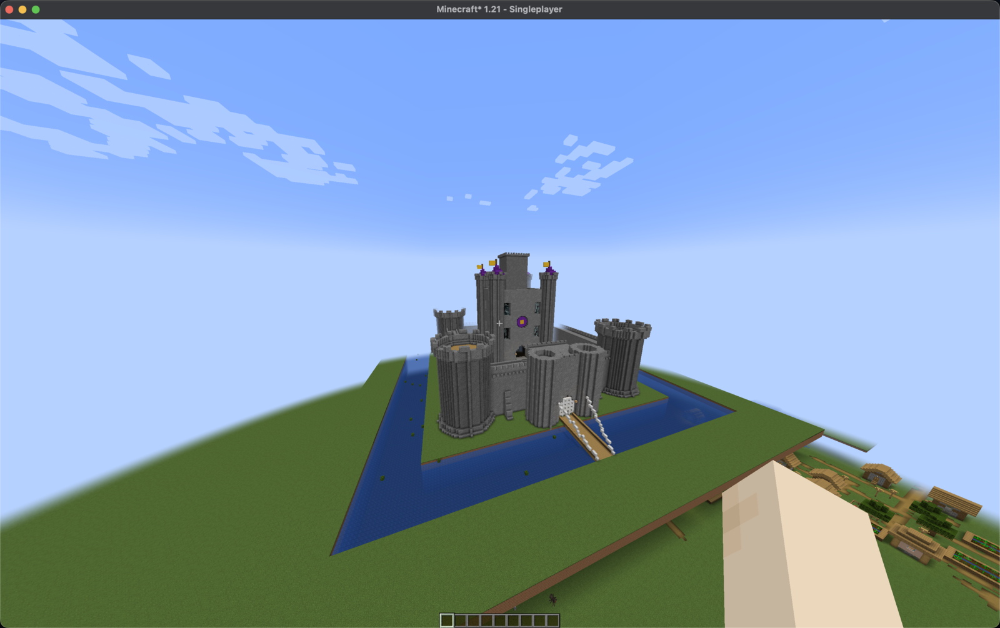

# Build Export and Import Guide

MineBench can export completed voxel builds to files that are useful outside the web viewer. The main paths are:

- JSON for the exact MineBench voxel build payload.
- GLB for Blender and other glTF tools.
- STL for mesh-only and 3D-print preparation workflows.
- Sponge schematic (`.schem`) for Minecraft through WorldEdit or FAWE.

This guide covers the export options, import workflows, and common failure modes.

## Where Exports Appear

The build export control is the cube/download icon on build cards and model build viewers. It appears when the viewer has a loaded `VoxelBuild`.

Current surfaces:

- Arena matchup build cards.
- Sandbox benchmark result cards.
- Sandbox live model result cards for legacy inline generations.
- Custom Build pages and Sandbox durable result cards for private generated builds.
- Leaderboard model detail prompt modal after the selected build has loaded.

The live generation surface also has a JSON download button. That is separate from the build export menu and exists for quickly saving the raw MineBench build payload.

Durable Custom Builds use server-side export jobs. The private `/custom/$CUSTOM_BUILD_ID` page can request GLB, STL, and `.schem` exports after generation succeeds, then downloads the stored artifacts through private links. The local CLI can write the same formats directly:

```bash
pnpm custom:build --json uploads/castle/castle-gpt-5-4-mini.json --exports glb,stl,schem
```

## Export Formats

Choose the format based on where the build is going:

| Destination | Format | Best for | Main limitation |
| --- | --- | --- | --- |
| MineBench archive/debugging | JSON | Exact source payloads | Not directly importable into Minecraft or Blender |
| Blender or 3D scene tools | GLB | Visual review, materials, editing, renders | Not a Minecraft world format |
| Mesh tools and slicers | STL | Geometry repair, slicers, 3D-print prep | No colors, block names, or materials |
| Minecraft | `.schem` | WorldEdit/FAWE import | Requires a mod/plugin and can be large |

## Example Imports

MineBench exports can be inspected in general 3D tools and pasted into Minecraft worlds.

| Blender GLB import | Minecraft WorldEdit import |
| --- | --- |
|  |  |

### JSON

JSON is the native MineBench build format. Use it when you want to re-import, debug, archive, or inspect the exact `version/blocks/boxes/lines` payload that MineBench rendered.

JSON is not a Minecraft import format by itself. Convert it to `.schem` through the MineBench export path before importing into Minecraft.

### GLB

GLB is the preferred Blender path.

MineBench writes one glTF material per block type. Materials include metadata in `extras`:

- `minebenchBlockId`
- `minecraftBlockState`

Use Blender's normal glTF importer:

```text
File -> Import -> glTF 2.0 (.glb/.gltf)
```

GLB keeps block colors/material identity, uses block-sized geometry, and is suitable for rendered previews, turntables, and further 3D editing. MineBench merges visible faces before writing GLB, so large solid builds are much smaller than one-cube-per-block geometry.

### STL and 3D Printing

STL is geometry-only. It does not preserve colors, block names, transparency, or material metadata.

Use STL for workflows that only need a mesh shell, such as mesh inspection, repair, slicer import, or 3D-print preparation. Prefer GLB for visual review because GLB preserves MineBench material information.

STL exports can be used as a starting point for 3D prints, but they are not guaranteed to be ready-to-print without cleanup. Large MineBench builds can include thin parts, floating pieces, intersecting surfaces, hidden cavities, and unsupported overhangs. Before printing, inspect and repair the mesh in a tool such as Blender, MeshLab, Netfabb, PrusaSlicer, Cura, or Bambu Studio.

Recommended print-prep checks:

- Confirm the model is manifold or repair it in the slicer.
- Scale the model to the target physical size.
- Check that thin voxel details survive at the chosen nozzle size and layer height.
- Add supports or split the model if there are large overhangs.
- Consider simplifying very large builds before slicing.

### Minecraft `.schem`

Minecraft export writes a gzip-compressed Sponge schematic v3 file.

MineBench schematic details:

- Root format: Sponge schematic v3 NBT.
- File extension: `.schem`.
- Dimensions: cropped to the occupied MineBench build bounds.
- Offset: `[0, 0, 0]`.
- Block states: MineBench block IDs mapped to Minecraft block states.
- Data order: `x + z * Width + y * Width * Length`.
- Empty cells inside the cropped bounding box are exported as air.

WorldEdit may report the affected count as the full rectangular schematic volume, not only the MineBench `blockCount`. For example, a `217 x 91 x 217` schematic can report `4,285,099 blocks affected` even when the source build contains `345,434` non-air blocks.

## Recommended Minecraft Path

Use WorldEdit for normal local imports. Use FAWE when importing very large builds on a server or when paste performance matters more than a simple setup.

A custom MineBench Minecraft plugin is not needed for the current workflow. `.schem` is already the standard interchange format for WorldEdit-compatible tools, and it keeps MineBench imports compatible with existing Minecraft mod/plugin ecosystems.

Vanilla structure blocks are not the default import path. They can work for small one-off structures, but their workflow is awkward for large MineBench-scale exports, and they do not replace WorldEdit or FAWE for practical benchmark imports.

### Client-side Singleplayer

Use this path for local visual checks and screenshots.

1. Install Minecraft Java Edition.
2. Install Fabric Loader for the Minecraft version you want to use.
3. Install matching Fabric API and WorldEdit Fabric jars into the Minecraft `mods` folder.
4. Launch the Fabric profile.
5. Create or open a Creative world with commands enabled.
6. Export a MineBench build as Minecraft (`.schem`).
7. Move the `.schem` file into the WorldEdit schematics folder.
8. Load and paste it in-game.

Common schematics folders:

```text
macOS:
~/Library/Application Support/minecraft/config/worldedit/schematics

Windows:
%APPDATA%\.minecraft\config\worldedit\schematics

Linux:
~/.minecraft/config/worldedit/schematics
```

Import commands:

```text
/schem list
/schem load minebench-file-name
//paste -a
```

Use the filename without `.schem` in the load command. `//paste -a` skips air blocks and is safer when pasting into a world that already contains terrain or previous test imports. Use plain `//paste` only when you intentionally want schematic air to clear the destination volume.

Useful commands while testing:

```text
//undo
/gamemode creative
/gamerule doMobSpawning false
/time set day
/weather clear
```

For screenshots, a superflat Creative world is the simplest target. Fly above or beside the intended location before pasting a large build so the structure lands in view and does not bury the player.

### Server-side WorldEdit

Use this path when importing into a shared or production Minecraft server.

1. Install WorldEdit for the server platform.
2. Restart the server and confirm WorldEdit commands are available.
3. Copy the `.schem` file into the server schematics folder.
4. Join as an operator or a user with WorldEdit permissions.
5. Load and paste the schematic.

Common server folders:

```text
Bukkit, Spigot, Paper:
plugins/WorldEdit/schematics

Fabric, Forge, NeoForge server:
config/worldedit/schematics
```

Recommended server commands:

```text
//schem list
//schem load minebench-file-name
//paste -a
```

For large MineBench builds, paste in an empty test world first. If the paste is too slow or blocks the server thread, use FAWE instead of standard WorldEdit.

### FAWE

FAWE is the practical option for large public-server imports. It supports WorldEdit-style schematic workflows while handling large edits more efficiently.

Use FAWE when:

- The schematic's cropped volume is several million cells or more.
- Standard WorldEdit freezes the server during paste.
- You need safer queueing, history, or async paste behavior.

The command shape is intentionally similar:

```text
//schem load minebench-file-name
//paste -a
```

Exact permissions and queue behavior depend on the server platform and FAWE configuration.

## Choosing a Build to Export

Export the specific build you want to inspect, not just any build from the same prompt. MineBench stores separate outputs for each model and prompt, and quality can vary dramatically.

Before diagnosing an import problem, confirm:

- The filename matches the intended model and prompt.
- The source build has the expected `blockCount`.
- The source bounds are plausible for that prompt.
- The source material mix looks plausible.

A paste that looks flat, mostly water, mostly grass, or otherwise wrong can still mean WorldEdit imported the file correctly. The source build itself may be poor or the wrong file may have been loaded. In one local validation pass, a `34 x 3 x 34` source build pasted exactly as exported; the issue was that it was not the intended Gemini 3.1 Pro castle.

## Troubleshooting

### `Unknown command`

WorldEdit is not loaded in the current game/server.

Check that:

- The Fabric/Forge/NeoForge profile is selected for client-side use.
- The WorldEdit jar is in `mods` for modded clients/servers.
- The WorldEdit plugin jar is in `plugins` for Bukkit/Spigot/Paper.
- The game/server version matches the WorldEdit build.

### `Schematic not found`

Check the folder and filename.

Use:

```text
/schem list
```

or:

```text
//schem list
```

Then load the name shown by WorldEdit, usually without the `.schem` extension.

### Paste looks like a flat slab or the wrong material

Confirm the source build before changing exporter code.

Check:

- Did the correct model's file get loaded?
- Did a previous smaller schematic remain in the folder?
- Is the MineBench source build itself flat or mostly one material?
- Does the reported WorldEdit affected count match the schematic dimensions?

If the affected count matches the schematic volume, WorldEdit probably loaded the file correctly.

### Paste clears terrain or previous tests

Use:

```text
//paste -a
```

Plain `//paste` includes air cells from the rectangular bounding box. That is useful when preserving exact empty interior spaces, but it can clear terrain around a build.

### Game freezes during paste

Large MineBench builds can have hundreds of thousands of non-air blocks and millions of cells in the schematic volume.

Try:

- Wait for the paste to finish before clicking around.
- Reduce render distance before pasting.
- Paste into a fresh superflat world.
- Use `//paste -a`.
- Use FAWE on a server for very large imports.

### Water or lava spreads after paste

MineBench exports water and lava as Minecraft fluid block states. Minecraft may update them after the paste.

For visual validation, paste in a flat test world with room around the build. If fluids obscure a structure, use WorldEdit selection tools or a copied variant without fluids for the screenshot workflow.

## References

- Sponge schematic specification: https://github.com/SpongePowered/Schematic-Specification
- WorldEdit clipboard and schematic docs: https://worldedit.enginehub.org/en/latest/usage/clipboard/
