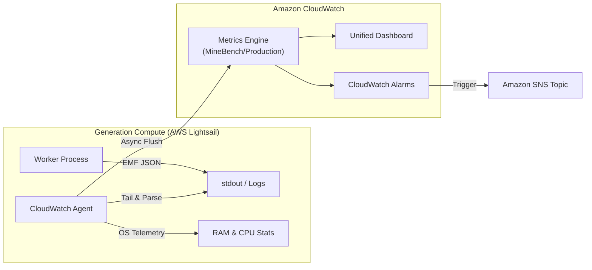

# CloudWatch Metrics & Architecture

MineBench publishes asynchronous telemetry to Amazon CloudWatch to monitor generation workloads, throughput, latency distributions, worker health, and queue latency.

## Metrics Specification

All telemetry is emitted under the `MineBench/Production` namespace.

| Metric | Unit | Description |
| :--- | :--- | :--- |
| `GenerationsCount` | Count | Aggregate successful generation volume (Sum). |
| `GenerationDuration` | Milliseconds | Generation latency distribution (p50, p90, p95, p99, Min, Max). |
| `ActiveGenerations` | Count | In-flight generation concurrency gauge. |
| `QueuedJobsCount` | Count | Count of generation jobs waiting in the queue. |
| `OldestQueuedJobAgeSeconds` | Seconds | Age of the oldest waiting job in queue. |
| `GenerationErrors` | Count | Count of failed generation attempts, tagged by error classification. |
| `mem_used_percent` | Percent | Host memory utilization percentage. |
| `disk_used_percent` | Percent | Host disk space utilization percentage. |
| `cpu_usage_idle` | Percent | Host idle CPU percentage. |
