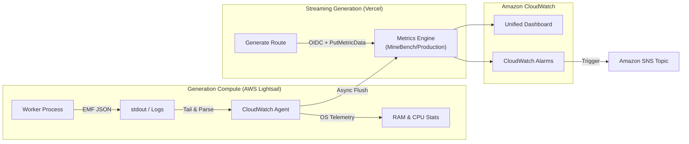

# CloudWatch Metrics & Architecture

MineBench publishes asynchronous telemetry to Amazon CloudWatch to monitor generation workloads, throughput, generation time, worker health, and queue wait time.

## Metrics Specification

All telemetry is emitted under the `MineBench/Production` namespace.

| Metric | Unit | Description |
| :--- | :--- | :--- |
| `GenerationsCount` | Count | Aggregate successful generation volume (Sum). |
| `GenerationDuration` | Milliseconds | Successful build generation time, split by model; not web request latency. |
| `ActiveGenerations` | Count | In-flight generation concurrency gauge. |
| `WorkerAcceptingJobs` | Count | `1` while the worker accepts jobs and `0` while it drains. |
| `QueuedJobsCount` | Count | Count of saved-generation and private-checkpoint jobs waiting in the queue. |
| `OldestQueuedJobAgeSeconds` | Seconds | Age of the oldest waiting generation job. |
| `GenerationErrors` | Count | Count of failed generation attempts, tagged by error classification. |
| `mem_used_percent` | Percent | Host memory utilization percentage. |
| `disk_used_percent` | Percent | Host disk space utilization percentage. |
| `cpu_usage_idle` | Percent | Host idle CPU percentage. |

Worker heartbeats and queue health are emitted immediately at startup and every 30 seconds. They continue while active work drains after shutdown begins, so deploys remain visible. The queue alarm treats missing telemetry as unhealthy; `WorkerAcceptingJobs` is currently dashboard-only.

Success, duration, and error events publish both an `Environment` aggregate for alarms and detailed model dimensions for dashboards. CloudWatch does not aggregate custom metrics across dimension sets automatically, so alarms must use the aggregate series.

## Generation time versus responsiveness

`GenerationDuration` comes from `generateVoxelBuild().generationTimeMs`. It covers provider requests, repair attempts, and build execution/validation, subtracting caller callbacks and time waiting for the worker's build-processing gate. It excludes the initial durable queue wait and subsequent artifact storage. It is mostly inference time, but is not a pure provider-only timer.

A successful build taking 20 minutes is expected for some models. Keep its duration visible by model instead of paging on one global threshold. The metric is emitted on success, so it cannot detect a generation that never finishes.

Website responsiveness is measured separately through Vercel Speed Insights and the `minebench.arena.*` / `minebench.voxel.*` delivery and rendering metrics. None of the CloudWatch alarms below measures page load or API response latency.

## Production alarms

Verified in `us-east-1` on 2026-09-05. Enabled alarms notify the `minebench-production-alerts` SNS topic, which has one confirmed email subscription. They have no recovery or insufficient-data notification actions.

| Alarm | Trigger | Assessment |
| :--- | :--- | :--- |
| `MineBench-HighLatency` | p95 `GenerationDuration` > 60 seconds in one 5-minute period | **Notifications disabled.** Successful long inference is expected. The dashboard labels this metric “Generation time.” |
| `MineBench-GenerationErrors` | At least one failed generation attempt in 5 minutes | Sensitive: includes user credentials, exhausted credits, invalid model output, and provider errors as well as infrastructure failures. Keep error details visible; consider paging only on actionable infrastructure failures or sustained failures after defining the desired policy. |
| `MineBench-HighCPU` | Average CPU busy >= 85% for two consecutive 5-minute periods | Reasonable sustained host-pressure warning; missing data becomes insufficient data. |
| `MineBench-HighMemory` | Average RAM used >= 85% for two consecutive 1-minute periods | Reasonable for the small worker host; missing data becomes insufficient data. |
| `MineBench-StuckQueuedGenerations` | Maximum oldest runnable queue age >= 180 seconds for two consecutive 1-minute periods | Detects waiting work, not running inference. Missing data breaches. A healthy worker at capacity can also trigger this, so inspect active jobs and accepting-jobs status before treating it as stuck. |

Low traffic makes the duration alarm especially noisy: a single completed build can determine the period's p95, then an idle period returns it to OK because missing data is non-breaching. CloudWatch supports [ignoring low-sample percentiles](https://docs.aws.amazon.com/AmazonCloudWatch/latest/monitoring/percentiles-with-low-samples.html), but that would not make generation duration a useful responsiveness alarm.

The seven days reviewed contained 84 HighLatency ALARM transitions, 27 GenerationErrors transitions, and one StuckQueuedGenerations transition. There were 206 recorded successes and 71 error events; these are telemetry events, not a unique-job failure rate, because retries can emit errors before success.

### Coverage limits

- `WorkerAcceptingJobs`, disk usage, and swap usage have metrics but no dedicated alarms. Queue telemetry can detect a dead reporter; a live draining worker with an empty queue will not trip the queue alarm.
- Active jobs and queue health include private checkpoint work. Success/duration/error events currently cover saved Sandbox generation jobs and `/api/generate` streams, not private checkpoint generations, imports, or all benchmark batch jobs.
- `ActiveGenerations` measures worker jobs, not simultaneous Vercel streams.
- Host metrics belong to the worker host; they do not describe Vercel web functions or database health.
- Worker logs use `/minebench/production/worker` with 14-day retention.

## Vercel publishing

Production Vercel Functions can publish through a narrowly scoped AWS OIDC role. No long-lived AWS credentials are stored in Vercel. Publishing is disabled unless `MINEBENCH_CLOUDWATCH_ROLE_ARN` is present in the production environment. `MINEBENCH_CLOUDWATCH_REGION` defaults to `us-east-1`.

The IAM role may only call `cloudwatch:PutMetricData` when `cloudwatch:namespace` is `MineBench/Production`. Preview and development deployments never publish production metrics.
