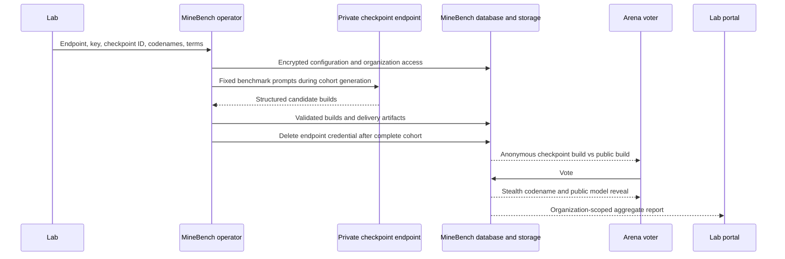

# Private Checkpoint Evaluations

MineBench can run blind, LM Arena-style A/B evaluations for unreleased model
checkpoints. An evaluation is administered by MineBench, appears inside the
ordinary public Arena, and reports only to invited members of the sponsoring
organization.

Each private matchup contains exactly one codenamed checkpoint and one public
MineBench model. The voter sees neither identity before voting. After a vote,
the public model is named normally and the private model is revealed as
`Stealth • Codename`. Private checkpoints never appear on the public
leaderboard.

## Provider contract

A lab supplies MineBench through a confidential channel with:

- an HTTPS endpoint implementing OpenAI-compatible `POST /chat/completions`;
- a bearer API key;
- the endpoint's private model or checkpoint ID;
- one codename per checkpoint or configuration under test;
- supported output settings, reasoning mode, and request-rate constraints;
- the decisive-vote target and authorized report recipients;
- raw-export, retention, disclosure, and publication terms; and
- an agreement reference used to bind the operational record to those terms.

Structured JSON output is required by default. MineBench sends a strict JSON
schema, validates every response, and retries invalid outputs within the
configured attempt limit. A provider that does not implement strict structured
output can be onboarded only when the lab explicitly accepts the unstructured
fallback. Tool mode does not grant the checkpoint network or shell access: the
model returns a JSON description of a local voxel operation, and MineBench
executes that operation in its existing restricted runtime.

The initial provider contract deliberately supports one common protocol. A lab
with different authentication, request, or response semantics needs a reviewed
provider adapter before onboarding.

## Request and data flow

The lab endpoint is a generation-time dependency only. It is never called from
an Arena request, never exposed to a browser, and never placed on the voting
latency path. Generation uses the fixed `BENCHMARK_PROMPT_MAP` cohort at grid
256, the simple palette, and precise mode. A variant cannot activate until all
cohort builds validate and their normal Arena delivery artifacts are prepared.

## Blindness and rating isolation

Matchup responses contain no model names, providers, keys, ratings, stable build
IDs, or build checksums. The matchup envelope and per-matchup build capabilities
are encrypted with AES-256-GCM, expire after two hours by default, and bind the
prompt, sides, build checksums, and private variant. Private artifact responses
are proxied with the per-matchup capability identity instead of redirecting to
a stable storage path. This prevents a voter from learning a stable identifier
in one revealed match and recognizing it before a later vote.

The vote response is the only pre-release identity-reveal path. Skipping moves
to a new matchup without revealing either identity.

Private variants keep independent Glicko state. A vote updates the codenamed
variant against the public model's current rating as a read-only anchor. It does
not change the public model's rating, vote or impression counters, prompt
coverage, pair coverage, rank history, or leaderboard metrics. Rating replay
follows the same chronological rule through `pnpm elo:recompute`.

## Access and reporting

MineBench provisions the sponsoring organization and invites named recipients
through Supabase Auth. Roles are:

| Role | Aggregate reports | Deidentified vote export |
| --- | --- | --- |
| Owner | Yes | When contracted |
| Admin | Yes | When contracted |
| Analyst | Yes | When contracted |
| Viewer | Yes | No |

Membership and invitation changes are MineBench operator-managed.

The portal reports outcomes, score, rating deviation, confidence, target
progress, side balance, prompt performance, public-opponent performance,
generation status, and an estimated position against the current public field.
That position is a private estimate, not a public leaderboard placement.

When `DEIDENTIFIED_VOTES` is authorized, exports include UTC date, codename,
public prompt, public opponent, checkpoint side, and normalized outcome. They do
not include account IDs, session IDs, vote IDs, matchup IDs, IP addresses,
request headers, or exact timestamps. `AGGREGATES_ONLY` is the default.

## Security controls

- Endpoint configurations are schema-validated, encrypted with AES-256-GCM,
  and stored in a table with row-level security and no authenticated-client
  read policy.
- `STEALTH_CONFIG_ENCRYPTION_KEY` is a dedicated 32-byte key. Losing it makes a
  pending credential unrecoverable; rotating it requires re-encrypting pending
  configurations before replacing the old key.
- The custom-provider guard resolves and pins the endpoint target, requires
  HTTPS outside local development, and blocks loopback, private, link-local,
  metadata, and DNS-rebinding targets.
- Remote generation refuses to write unless the database and Supabase Storage
  resolve to the same project.
- Loopback generation stays inline and skips artifact uploads, even when the
  local shell also has remote storage credentials for read-only development.
- The operator supplies `STEALTH_ENDPOINT_API_KEY` only to the configuration
  command. The key is never a command-line argument, log field, generation
  record, report field, or browser value.
- A complete cohort disables the endpoint and deletes its encrypted credential.
  Partial generation retains the credential only so the failed cohort can be
  resumed. Withdrawal and closure also delete it.
- Public model queries, leaderboard statistics, benchmark surfaces, rank
  snapshots, coverage tables, seed operations, and upload sync explicitly
  exclude private variants.
- Lab pages and exports require a verified Supabase user plus an active
  organization membership and send private, no-store responses.

## Operator workflow

Run `pnpm stealth:eval help` for the authoritative flag list. The lifecycle is:

1. Generate a dedicated encryption key with `pnpm stealth:eval keygen`, then
   install it as `STEALTH_CONFIG_ENCRYPTION_KEY` in the target environment.
2. Run `create` to provision the organization and evaluation agreement record.
3. Set `STEALTH_ENDPOINT_API_KEY` in the operator process and run `configure`
   once per codename. Unset the process value immediately afterward.
4. Run `invite` for each authorized recipient. Use `revoke` to remove a
   membership without deleting a user who may belong to another organization.
5. Run `generate`. The first missing prompt validates the endpoint before the
   rest of the fixed cohort is generated. Successful prior prompts are reused
   on a partial retry.
6. Inspect `status`, generation records, artifacts, and the lab portal.
7. Run `activate` only after the cohort is complete and alpha acceptance passes.
8. Use `pause` for a reversible sampling stop, `stabilize` after every variant
   reaches its decisive-vote target, `withdraw` for one variant, or `close` for
   the full evaluation.
9. Close the evaluation, then run `release` only after the lab attests that the
   named public model is the exact evaluated checkpoint. The mapping is recorded, but private ratings and
   votes are never transferred. Public evaluation starts with fresh votes.

All operator commands are idempotent where repetition is safe. Configuration
changes are refused after sampling begins, and checkpoint identity cannot
change after a cohort has started. `disable-endpoint` is the immediate
credential-revocation command.

## Alpha acceptance gate

Every private evaluation must pass the alpha environment before production
activation:

1. Apply the migration and deploy the feature branch to alpha.
2. Create a test organization, variant, and invited account against alpha.
3. Confirm the invitation, magic-link sign-in, organization boundary, and role
   behavior.
4. Generate the complete cohort and verify that the credential row is gone,
   the variant endpoint is disabled, and every build has a checksum and Arena
   artifact metadata.
5. Set alpha's stealth share to 1 for acceptance traffic. Confirm exactly one
   private variant per matchup, no names or stable IDs before voting, no reveal
   on skip, and `Stealth • Codename` only after a successful vote.
6. Compare public leaderboard ratings, counters, coverage, rank snapshots, and
   benchmark surfaces before and after private votes; they must be unchanged.
7. Confirm the lab report updates, Viewer cannot export, and an authorized CSV
   contains no direct or pseudonymous voter identifiers.
8. Exercise pause, resume, withdrawal, closure, retention metadata, and exact-
   checkpoint release attestation.
9. Run the normal lint, test, build, migration-drift, artifact-audit, and browser
   smoke suites before promotion.

Alpha uses separate database, storage, authentication, encryption, and endpoint
credentials. No production checkpoint secret is copied into alpha unless the
lab explicitly provides an alpha-scoped credential.
